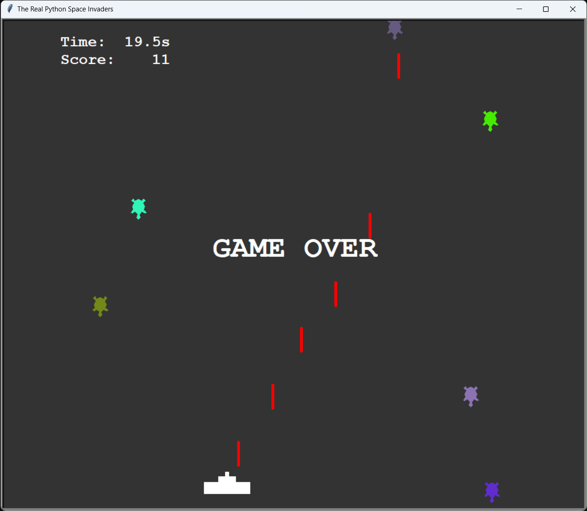

# Turtle Invaders

> mini Space Invaders clone via Python `turtle`



A Space Invaders clone made using `turtle`, following the Real Python tutorial [Build a Python Turtle Game: Space Invaders Clone](./notes.md).

## Installation

All you need is a working Python 3.9+.

## Usage

```sh
python turtle_invaders.py
```

## Release History

* v1.1
  * extra polishing
* v1.0
  * working minimal

## License

This project is distributed under MIT license. See [LICENSE](./LICENSE) for more information.
